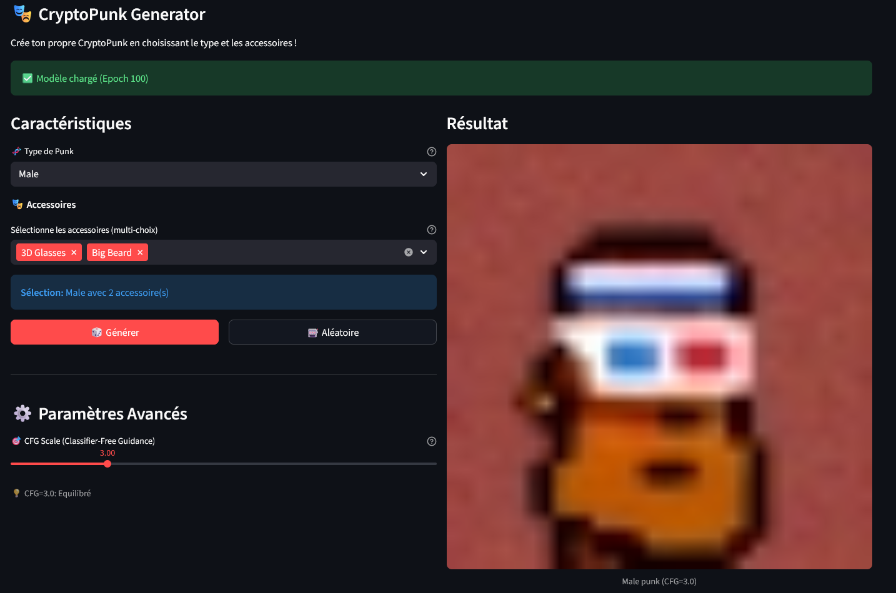
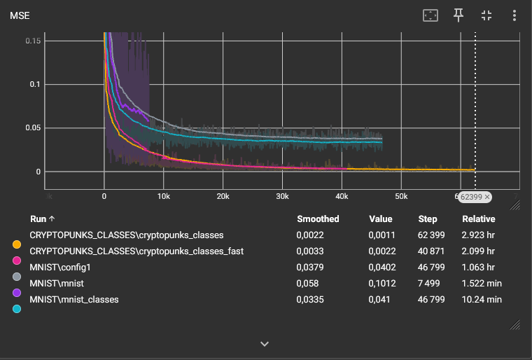

# Diffusion Model - DDPM & Generative AI

Implémentation complète "from scratch" de **Denoising Diffusion Probabilistic Models (DDPM)** en PyTorch.
Ce projet explore la génération d'images, partant du simple débruitage sur MNIST jusqu'à la génération conditionnelle multi-attributs sur CryptoPunks (Genre, Accessoires, etc.) en utilisant le **Classifier-Free Guidance (CFG)**.


## 🏗️ Structure du Projet

```
Diffusion/
├── data/                  # Données brutes (MNIST, CryptoPunks)
├── models/                # Checkpoints sauvegardés (.pt)
├── results/               # Résultats de génération (images, gifs)
├── runs/                  # Logs Tensorboard
├── src/
│   ├── tools/             # Scripts de téléchargement des données
│   ├── config.py          # Configurations des modèles
│   ├── dataset.py         # Gestion des datasets et metadata
│   ├── diffusion.py       # Algorithme DDPM & Sampling
│   ├── model.py           # Architectures U-Net (Simple & Conditionnel)
│   └── utils.py           # Utilitaires divers
├── streamlit_dashboard.py # Interface complète de supervision & génération
├── train.py               # Script d'entraînement principal
└── infer.py               # Script d'inférence en ligne de commande
```

## 🚀 Installation & Utilisation

### 1. Environnement

Activez votre environnement virtuel Python :

```powershell
.venv\Scripts\Activate.ps1
```

### 2. Données

Téléchargez les datasets nécessaires via les scripts dans `src/tools/` :

```bash
# Pour CryptoPunks simple
python -m src.tools.download_cryptopunks

# Pour CryptoPunks avec métadonnées (classes/attributs)
python -m src.tools.download_cryptopunks_with_metadata
```

(MNIST est téléchargé automatiquement au premier lancement).

### 3. Dashboard Interactif (Recommandé)

Tout le projet se pilote via le **Streamlit Dashboard** qui regroupe :

- 📊 **Monitoring** : Suivi des courbes de loss (Tensorboard intégré).
- 🎯 **Training** : Lancement des entraînements sur différentes configurations.
- 🎨 **Inference** : Génération interactive (dessiner des chiffres ou créer des avatars).

<p align="center">
  
</p>

Pour le lancer :

```bash
streamlit run streamlit_dashboard.py
```

## 🧠 Modèles & Configurations

Les configurations sont définies dans `src/config.py`. Voici les principales architectures implémentées :

### 1. Modèles Non-Conditionnels

Diffusion standard pour apprendre la distribution des données.

- **`config1_mnist`** : U-Net léger pour MNIST (16x16).
- **`config1_cryptopunks`** : Modèle RGB pour visages (32x32).

### 2. Modèles Conditionnels (Classes)

Injection d'embeddings de classes pour guider la génération (ex: générer un "3").

- **`mnist_classes`** : Conditionnement simple (0-9).

### 3. Modèles Multi-Attributs (CFG)

Utilisation du **Classifier-Free Guidance** pour combiner plusieurs attributs.

- **`cryptopunks_classes_fast`** : Modèle avancé prenant en charge :
  - **Type** : Male, Female, Zombie, Ape, Alien.
  - **Accessoires** : 87 attributs (Lunettes, Chapeaux, Barbe...).
  - Permet de générer un avatar précis selon des critères choisis.

## 📈 Résultats

L'évolution de l'apprentissage est visible via les logs Tensorboard (`runs/`).



Le modèle final permet une génération contrôlée et cohérente grâce au guidage CFG, comme visible sur l'interface Streamlit.
